<h3><code>adix4612@github ~ $ ./contributions.sh</code></h3>

  

<h3><code>adix4612@github ~ $ whoami</code></h3>

<table>
<tr>
<td valign="top">

</td>

<td valign="top">

</td>
</tr>
</table>

 

<h3><code>adix4612@github ~ $ ./status.sh</code></h3>

<pre>
┌──────────────────────────────────────────────┐
│                                              │
│  Code. Analyze. Secure. Automate.            │
│                                              │
│  Turning Data into Decisions.                │
│                                              │
└──────────────────────────────────────────────┘
</pre>

